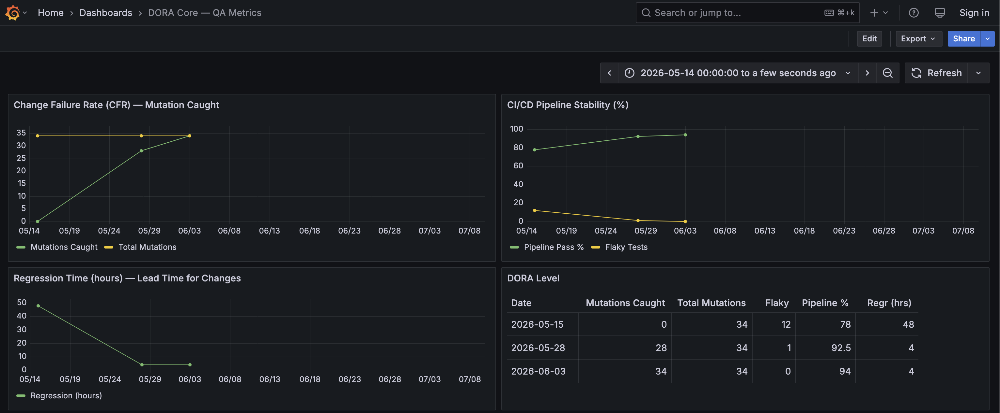

# Project: DORA Metrics System

**Type:** QA observability — real-time delivery quality measurement
**Duration:** Ongoing
**Status:** Live (5 dashboards in Grafana)

---

## Problem

QA metrics typically exist in static reports. They go stale within a sprint. Nobody reads them. When a deployment fails, the question "how often does this happen?" can't be answered without manual investigation.

---

## Approach

Adapted DORA's four core metrics + one reliability metric for QA:

| DORA Metric | QA Translation |
|-------------|---------------|
| Deployment Frequency | Test run frequency — how often do tests validate production? |
| Lead Time for Changes | Bug-to-fix latency — time from report to verified fix |
| Change Failure Rate | Mutation escape rate — % of injected bugs that tests miss |
| Mean Time to Recovery | MTTR — time from CI failure to pipeline green again |
| Reliability | CI/CD pass rate — % of runs that pass all quality gates |

---

## Dashboard View

*DORA Core dashboard — data from 3 CI runs (May 15 – Jun 3). Live Grafana, populated from CI/CD pipeline runs.*

## Architecture

---

## Results

| Metric | Before | After |
|--------|--------|-------|
| CFR | Unknown (no mutation testing) | 0% (34/34 caught) |
| MTTR | Days (manual investigation) | Immediate (CI notification) |
| API Coverage | 78% (estimated) | 94% (verified) |
| Flaky Tests | Many (40+ waitForTimeout) | 0 |
| CI Pass Rate | ~78% | 94% |
| Dashboards | 0 | 5 live in Grafana |

---

## Tools

Grafana, GitHub Actions, Allure TestOps, Playwright, Jest, fast-check, Python (charts)

---

## Source

[github.com/victor-2026/Test-Dora-Plus](https://github.com/victor-2026/Test-Dora-Plus)
